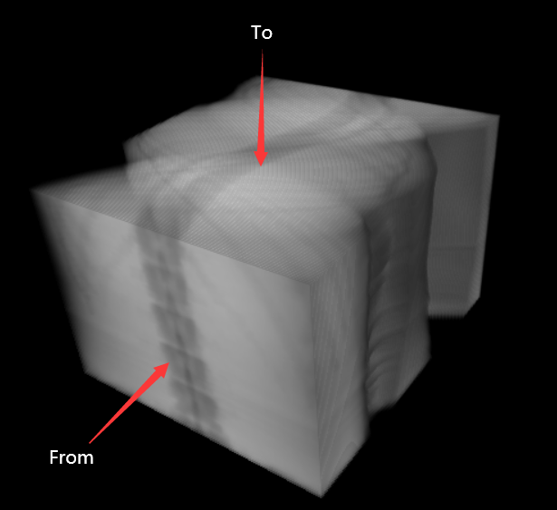
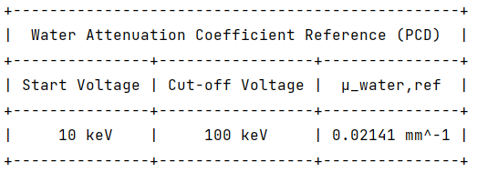

# Collections of some useful stuff
The following tools listed bellow are mainly for better use [mangoct](https://github.com/ustcfdm/mangoct).
### 1. Postfix change
```angular2html
./postfix_change/toRaw.py
```
Mainly used to modify the files' postfix in the folder.

Usage: use '--help' to show the hint, or:
```angular2html
python toRaw.py -d your-folder -p your-postfix
```
_Warning: File name contains extra '.' can cause unexpected truncation._

### 2. Preprocess
```angular2html
./preprocess/proj2sinogram.py
```
[mangoct](https://github.com/ustcfdm/mangoct) only accept sinogram, so when use cone beam reconstruction, keep the y axis the same and look at the x and V axes to construct sinogram. In other words, do the following change:

**postlog_img(x, y, V) => postlog_img(x, V, y)**



You can also use 'proj2sinogram.py' to do simple air correction, see 'config_helper.yml' for more config information.

Usage: use '--help' to show the hint, or:
```angular2html
python proj2sinogram.py -d config_helper.yml
```

### 3. Attenuation coefficient calculation
```angular2html
./attenuation_calc/water_ref.py
```
Mainly used to calculate the reference value of attenuation coefficient of water in a given X-ray spectrum. Spectrum files must follow the rules listed below:
- **'Energy   Photons'** style, no words before, allow words after.
- The unit of energy is 'keV' or 'eV'.

Example files are in './attenuation_calc/spec/'.

Usage: use '--help' to show the hint, or:
```angular2html
python water_ref.py your-spectrum-file-path -d detector-FPD-or-PCD
```
And the output would be like:


_No spectrum files? Measure your own machine or use SPEKTR 3.0 to simulate, this tool can process its direct output file._

Click [SPEKTR 3.0](https://istar.jhu.edu/downloads/) to find Source Code and Technical Note.